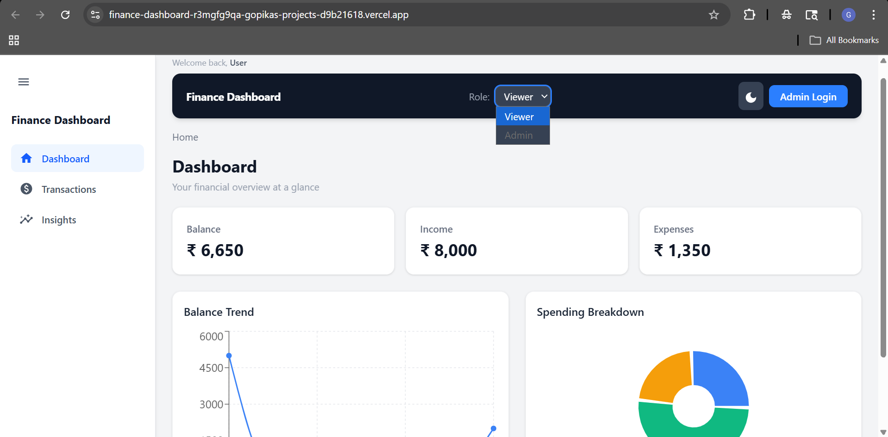
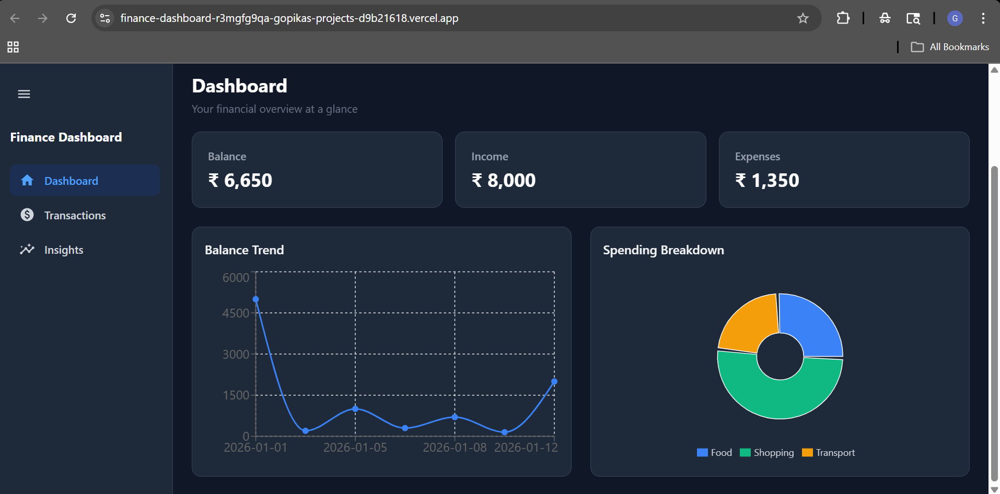
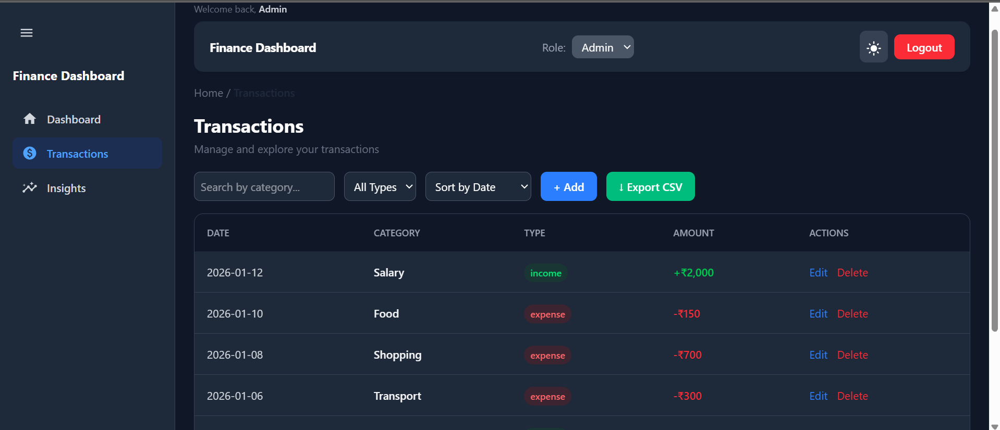
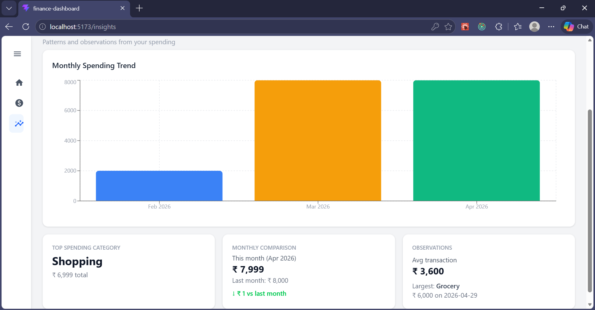
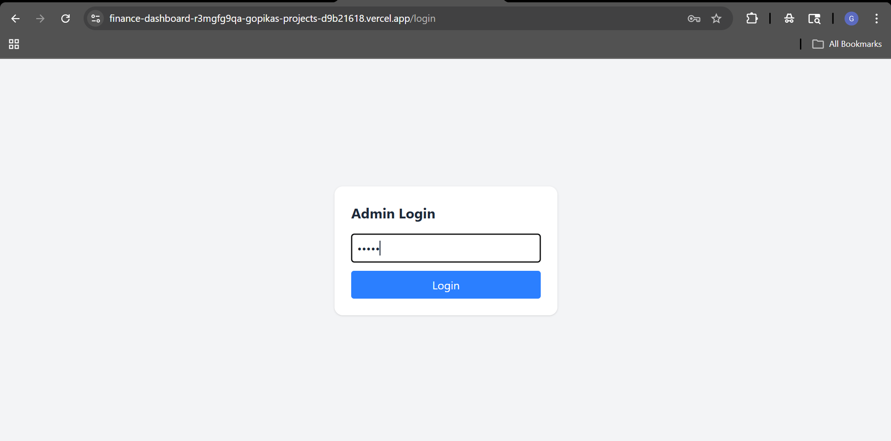

# Finance Dashboard

A clean, interactive finance dashboard built with React for tracking personal financial activity. Built as part of a Frontend Developer Intern assignment.

🔗 **Live Demo**: [finance-dashboard-alpha-liard.vercel.app](https://finance-dashboard-r3mgfg9qa-gopikas-projects-d9b21618.vercel.app)

---

## Tech Stack

- **React 18** + React Router v6
- **Tailwind CSS v4**
- **Recharts** — data visualization
- **Vite** — build tool
- **localStorage** — data persistence

---

## Features

- Dashboard with balance, income, and expense summary cards
- Line chart for balance trend and donut chart for spending breakdown
- Transactions table with search, filter by type, and sort by date or amount
- Add, edit, and delete transactions (Admin only)
- Role-based UI — Viewer and Admin with password-protected access
- Insights — top spending category, monthly comparison, and spending observations
- Dark mode with preference saved across sessions
- Export transactions as CSV
- Fully responsive across screen sizes

---
## Getting Started
```bash
git clone https://github.com/Gopika-s-34/finance-dashboard.git
cd finance-dashboard
npm install
npm run dev
```

Open [http://localhost:5173]

---

## Project Structure

src/
├── components/
│   ├── Card.jsx
│   ├── Charts.jsx
│   ├── Header.jsx
│   ├── Sidebar.jsx
│   └── Breadcrumbs.jsx
├── context/
│   └── AppContext.jsx
├── data/
│   └── mockData.js
├── pages/
│   ├── Dashboard.jsx
│   ├── Transactions.jsx
│   ├── Insights.jsx
│   └── LoginPage.jsx
├── utils/
│   └── helpers.js
├── App.jsx
└── main.jsx

---

## Screenshots

### Dashboard — Light Mode


### Dashboard — Dark Mode


### Transactions — Admin View


### Insights


### Login

